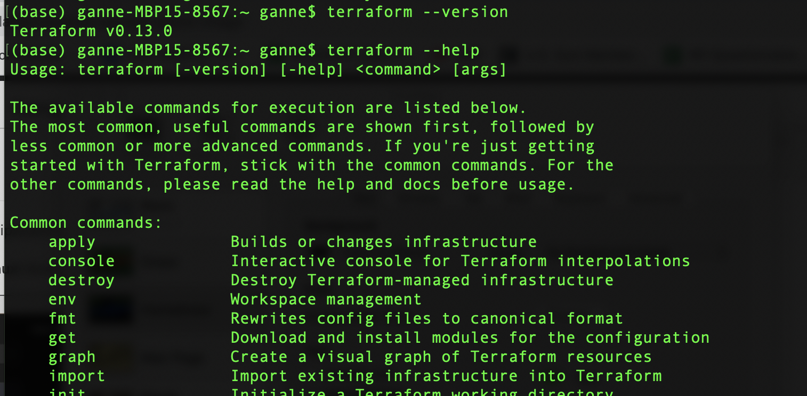
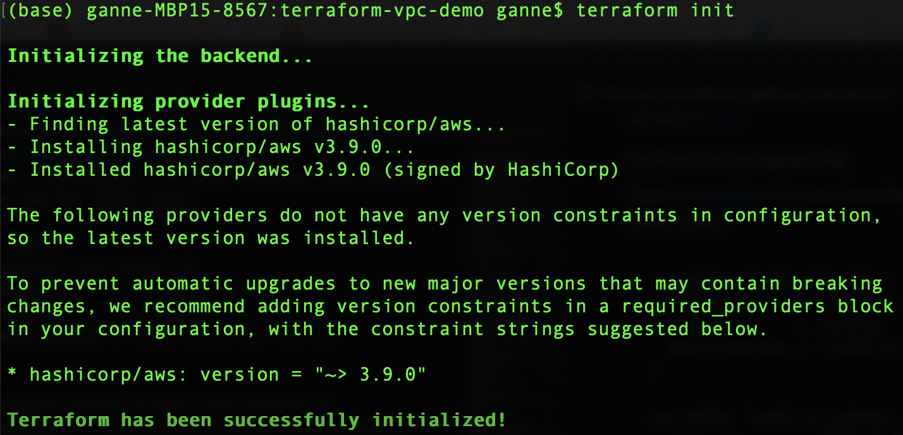
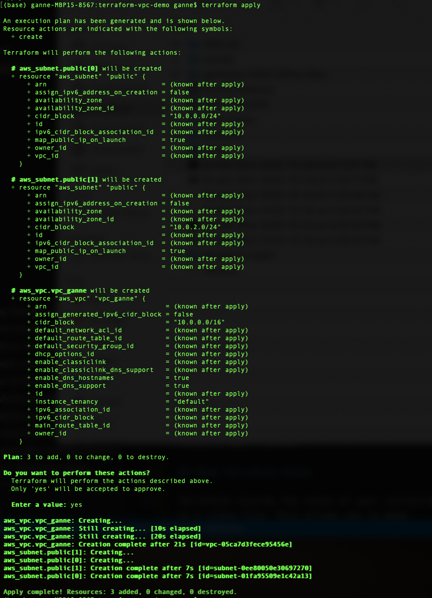
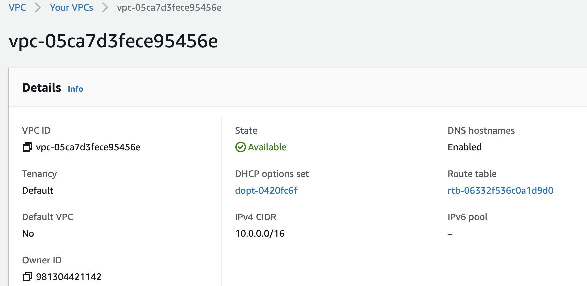
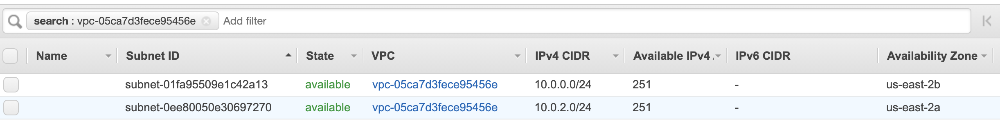
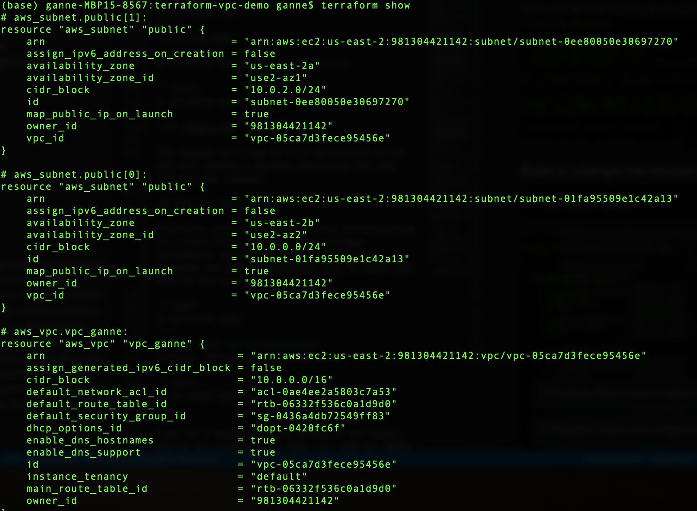
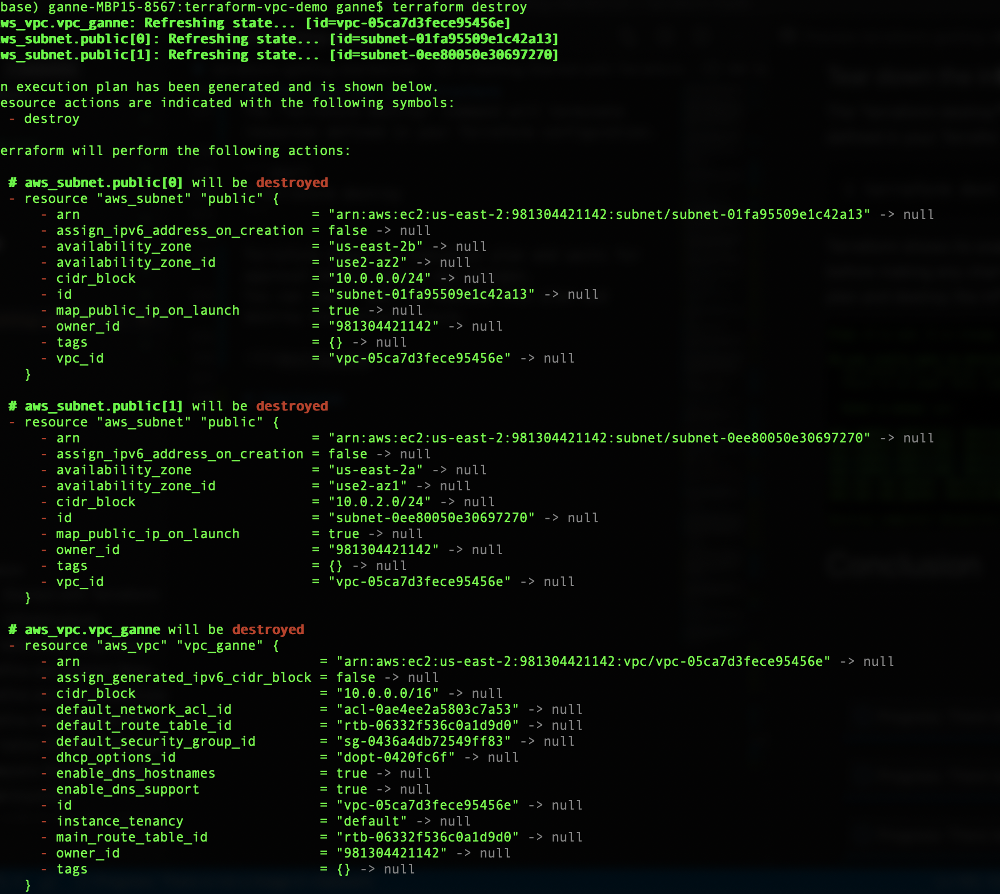
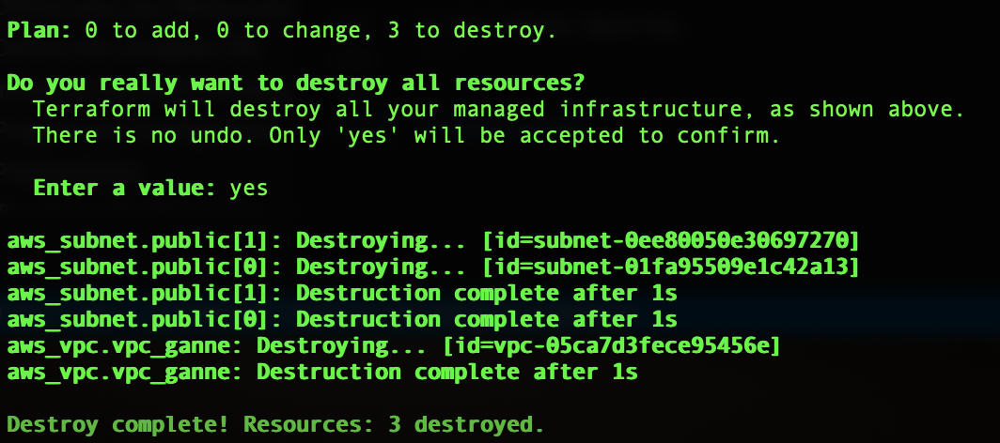

# Getting Started with Terraform

Welcome! In this tutorial, we will introduce the basics of how to use Terraform to define,build and manage infrastructure on AWS. You will learn how to create a VPC along with 2 Public Subnets.

## Introduction to Terraform
Terraform is a fully open sourced, configuration and orchestartion management tool by HashiCorp. It enables the declarative configuration of the infrastructure in structured text files so they can be managed like any other source code in a version control system. Terraform untilizes "infrastucture as code" as the operating framework under the hood and allows you to write the configuration file to plan, set up, change, and even dismantle an environment on baremetal servers or virtual machines on cloud platforms like AWS, GCP, GitHub, Docker, etc  

## How to Install Terraform
To install Terraform, locate the relevant binary from the download page [here.](https://www.terraform.io/downloads.html) Download and install the binary on your local machine. Make sure that the path to the terraform binary is available on your system's PATH. This process will differ depending on your operating system.

### Verify Installation
Verify the successful installation by testing out Terraform's available subcommands like help, version etc
```shell
$ terraform --version
$ terraform --help
```


## Build Infrastructure 
With Terraform installed,let's dive right in and create some infrastructure. Make sure you have all the prequisites in place before you get started.

### Prerequisites

To follow this tutorial you will need:

1. An AWS account

2. AWS CLI installed

3. AWS credentials configured locally 

### Terraform Configuration File
To build and deploy the infrastructure using Terraform, you need to create a configuration file. It is a human readable text file with “.tf" extension where you specify the infrastructure resource(s) you want to build.

Terraform configuration is strictly declarative. meaning, when you write code, you specify the desired end state, and terraform will take the steps to achieve that end state.

#### Provider
Infrastructure providers (for example AWS, Google Cloud, Azure) are called “Providers” in Terraform. which is provider is responsible for managing resources and handling API interactions for the pieces of infrastructure that they manage. In a terraform configuration file, a provider is initialized with the “provider” keyword.

#### Resource
A resource is service that a provider wants to expose and can be provisioned. For instance, a VPC is a resource in AWS provider. In a terraform configuration file, a resource is initialized with the “resource” keyword.


### Create a Working Directory
Each configuration should be in its own directory. Create a directory for the new configuration.

```shell
$ mkdir terraform-vpc-demo
$ cd terraform-vpc-demo
```

### Prepare the Configuration Files
Create a main.tf file for your Terraform configuration code.

```shell
$ touch main.tf
```
#### Initialize the AWS Provider
Open the main.tf file through your favorite text editor and add the following code to configure the AWS provider:

```shell
provider “aws”
{
access_key = “Your AWS Access Key”
secret_key = “Your AWS Secret Key”
region=”us-east-2”
}
```
The above code snippet will authenticate the user using AWS IAM account credentials. It also sets some important environment variables like “region” to tell AWS to build necessary resource in “us-east-2”. 

#### Define aws_vpc resource
Once the provider is configured, you will now add the code that will define an “aws_vpc” resource. Name of the resource in this case is “vpc_ganne”. Inside the resource block, specify values for parameters like cidr_block,enable_dns_support and instance_tenancy. You can find a complete list of parameters available for every resource in terroform documentation [here](https://registry.terraform.io/providers/hashicorp/aws/latest/docs/resources/vpc)

 ```shell
resource "aws_vpc" "vpc_ganne" {
  cidr_block           = var.cidr_block
  enable_dns_support   = true
  enable_dns_hostnames = true
  instance_tenancy     = ”default”
}
```

#### Define aws_subnet resource
Now time to add the "aws_subnet" resource to the main.tf file:

```shell
 resource "aws_subnet" "public" {
count=length(var.public_subnet_cidr_blocks)
vpc_id  = aws_vpc.vpc_ganne.id
cidr_block=var.public_subnet_cidr_blocks[count.index]
map_public_ip_on_launch = true
}

```
This main.tf will read values of input variables from "variables.tf" file, which you will configure in the next step. You may learn more about defining different types of input variables in terraform
 [here](https://www.terraform.io/docs/configuration/variables.html)
 
#### Define the input variables
To become truly shareable and version controlled, we need to parameterize the configurations. In order to do that, open a variables.tf in your favorite text editor and add the below code:

```shell
variable "cidr_block" {
  default     = "10.0.0.0/16"
  type        = string
  description = "CIDR block for the VPC"
}

variable "public_subnet_cidr_blocks" {
  default     = ["10.0.0.0/24", "10.0.2.0/24"]
  type        = list
  description = "List of public subnet CIDR blocks"
}
 ```

## Initialize the terraform deployment
When you create a new configuration within a  directory, you need to intiatialize it. "init" will install any providers that are not yet installed and initialize this new configuration

```shell
$ terraform init
```


## Build the infrastructure
To create the infrastructure you need to run the "terraform apply" command. Apply will use your existing credentials to authenticate you with AWS as the user and create the VPC resource. The output shows the execution plan and also asks for your approval before proceeding. If anything in the plan seems incorrect, you can safely stop the command from further executing, as there are no changes made to your infrastructure yet. If everthing looks good, input "yes" to proceed.

```shell
$ terraform apply
```


The command will take up to a few minutes to run and will display a message indicating that the resource was created with id:vpc-05ca7d3fece95456e

Congratulations you have created infrastructure using Terraform! You can now visit the AWS's VPC dashboard to find the newly created vpc and subnets. Make sure to look in the right region thats specified in the main.tf file.

####  VPC from AWS Console:


#### Subnets from AWS Console:


## Show Terraform State

Terraform records the state of your infrastructure in a state file. This allows you to make incremental changes in the future by simply changing the same configuration file to match your desired end state. "show" command will help inspect the current terraform state.

```shell
$ terraform show
```


## Tear down the infrastructure
The "terraform destroy" command will terminate resources defined in your Terraform configuration.

```shell
$ terraform destroy
```


Even when deleting resources, Terraform shows its execution plan and waits for approval before making any changes.You can input "yes" to execute this plan and destroy the infrastructure.



## Next Steps
 As Cloud becomes more popular and enterprises are migrating their workloads tocloud, Terraform allows you to treat infrastructure as a piece of software (code) which can be written once and can be automated to be used multiple times. Like we saw in this tutorial,If you want to provision a Virtual Private Cloud in AWS, you can write a terraform configuration to automate this process rather than doing it manually from AWS console.

Now that you have learnt how to create your first infrastructure using Terraform, continue to the next tutorial to modify your infrastructure.